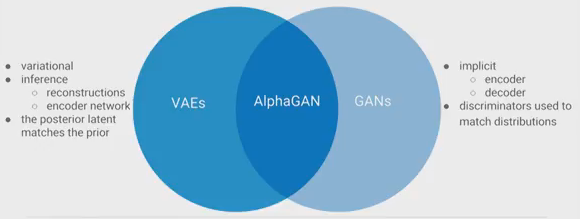

# Auto Encoder GANs
[Source video](https://youtu.be/bZ-xIRsyxNE)

## Mode collapse
* The generator generates the same image or variations of the same image again and again.
* Why?
    * Once G knows that it generated an image that can fool D, it will continue to do that same image every time (why changing, right?)

* Variations

Obvious | More subtle
---|---
 | 

## Autoencoders
* Set of models that **learns how to reconstruct data**: can cover entire dataset
* Use MSE -> Reconstructed images are blurry

### Adversarial autoencoders
* Adding a Discriminator (or a GAN loss specifically) -> improve reconstruction quality.
* Hence, combine these two for the best result

## How?
Different approaches:
1. Learning the code distribution
> Learn p(codes)   

* **Work on the code, not the data**
* Code distribution is simpler that data distribution.
2. Match the code dist. to a desired prior
> match prior   

* Like Gaussian, ...
* Make sure to **add in a cost function** that encoder will produce the code looks like desired dist.
* When sampling, just sample from the dist. to get the image.

## Learning from code distribution
1. PPGN (Plug and play generative models)
    * Reconstructions:
        * Autoencoder(to reconstruct)
        * GAN(prevent blurry)
        * Perceptual loss in future space(reconstruction passed to pretrained classifiers(resnet, ...) and actual image from ImageNet are **similar**)
    * Samples
        * Markov Chain: sample from code dist.
        * Conditioning
    * Sampling from denoising autoencoders
        * Input + noise -> strange dist. + low prob. (of being similar to known dist.) --pass to--> Markov Chain (to increase prob.) --> repeat until prob. is similar to known dist.
        * 

    * Limitations:
        * Not end to end
            * Need a pretrained encoder (on the same dataset)
        * Depends on labels for:
            * Conditioning samples
            * Pretrained encoder
        * Markov Chains
            * When to stop?? (close to the known dist. yet?)
            * missing rejection step

## Match a desired prior
1. Variational (Auto Encoder) inference - the ELBO
* Instead of maximizing the log likelihood of data, it maximizes **Evidence lower bound** on log prob. of data
* It both provides good reconstruction and match prior dist.

* Both terms are **computed analytically**   

## AlphaGAN
Combining GANs and VAEs   

* Both terms are now **estimated code/data discriminator** from samples

### But HOW??
* Density ration trick
    * Build a **binary classifier** to distinguish
    * 

### From ELBO to loss function
* We want to match:
    * reconstruction and data: likelihood term
    * code and prior distributions: KL term
* Tools for matching distribution
    * GAN: density ration
    * VAE: observer likelihoods(reconstructions losses)

### New loss function
* IDK anymore

## [Improved Techniques for Training GANs](https://arxiv.org/abs/1606.03498)

# Summary

> Try Autoencoder GANs if mode collapse is a problem.