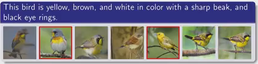

# StackGAN
_*Text to Photo-realistic Image Synthesis with Stacked Generative Adversarial Networks*_    
[Source video](https://youtu.be/y3rCLtyAcjk)

## Generating images from text descriptions   

* Related works
    * GAN-INT-CLS (Reed et al., ICML, 2016) Generative Adversarial Text-to-Image Synthesis
    * GAWWN (Reed et al., NIPS, 2016) Learning what and where to Draw
    * StackGAN (Zhang et al., ICCV, 2017) Text to Photo-realistic Image Synthesis w/ StackGAN
    * StackGAN-v2 (Zhang et al., arXiv, 2017) StackGAN++, Realistic Image Synthesis w/ StackGAN

## Conditional GAN
* G and D both need to recieve additional condition variables.

## StackGAN: Two-stage GANs
* Text desc. --stage1--> 64x64 image --stage2--> 256x256 image

### Architecture
* Conditioning Augmentation (CA)
    * Previous encoding text to code (Reed et al.) give high dimensional embedding --> Condition variable

* Stage-I
    * Generator: Upsampling (sketch time)
    * Discriminator: Downsampling + Text Embedding (from beginning)

* Stage-II:
    * Input: 64x64 images from stage 1 + Text embedding
    * Generator: Downsampling + text embedding + Residual blocks + upsampling --> 256x256 results
    * Discriminator: Down sampling + text embedding
    * Overall: corrects defects, completes details, and produces photo-realistic images

    * Problem:
        * Not end to end learning framework: stage1 fails -> stage2 fails too
## StackGAN-v2: Multi-distribution GANs
* Improvements:
    * End-to-end training
    * Stable training
    * Better generated-images

## Follow-up work: AttnGAN