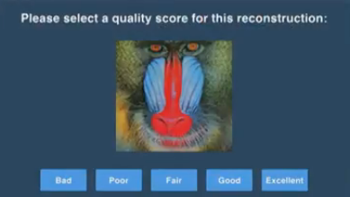
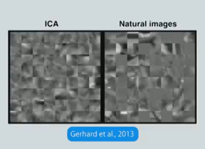

# Evaluating Generative Models
[Source Video](https://youtu.be/Rqa60NXCPao)   
Speaker: Lucas Theis, Twitter @lucastheis

Tips:
    * Choice of application is important
    * Different metrics favor different models
    * Be suspicous of heuristics

## Choice of application is important
1. Image recontruction
    * Evaluation: Psychophysics, MOS test
    * Training: Perceptual metric   

2. Image systhesis
    * Evaluation: Psychophsics, MOS test
    * Training: Perceptual similarity, variability   

    * Ask user which one is real/fake.

3. Lossless compression
    * Evaluation: Log-likelihood
    * Training: Log-likelihood
    * However, evaluating GAN w/ log-likelihood does not go well.

4. Unsupervised learning
    * Evaluation: Downstream tasks (e.g. classification)

## Different metrics favor different models
1. 

