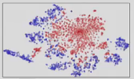
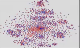
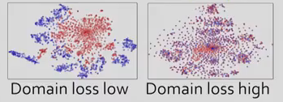
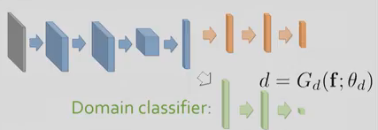
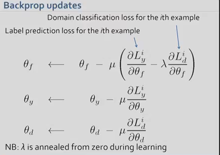
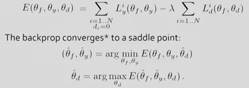
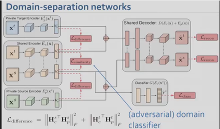
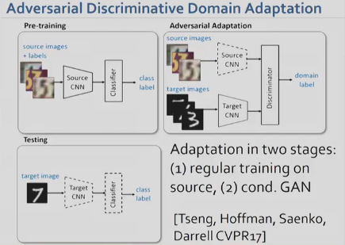

# Domain Adaptation Using Adversarial Learning
[Source video](https://www.youtube.com/watch?v=uUUvieVxCMs&index=8&list=PLazcgz-LJ6ZIrJV-qiqw16JyJFuE4TNKF)   
Speaker: Victor Lempitsky, Skoltech, Moscow, Russia

* What we have:
    * Lots of labeled data in the source domain (synthesis images)
    * Lots of unlabeled data in the target domain (real images)
* What we want:
    * train on deep net on source domain that does well on target domain

### Problem   
* Feature distributions (of target) do not match them of source dist (blue is source, red is target)   

    
### Goal
* Align two distributions so that they are similar.   
    

## Aligning domain distributions in feature space
* **Overall approach**: add a loss to measure dist. mismatch into learning process
    * Measuring second-order moments mismatch (Sun and Saenko 2016)
    * Maximum mean discrepancy (MMD) (Long and Wang ICML 2015)
    * Through Adversarial Learning: ...

## Alignment through Adversarial learning:
### Adding domain classifier (Discriminator)
* From a point, try to predict which domain it comes from.
* If 2 domain dist. are:
    * distinguishable: domain loss will be **low**
    * mixed: domain loss will be **high**   
    

* Network:
    * Build the network
    * Train *feature extractor + class predictor* on source data
    * Train *feature extractor + domain predictor* on source + target data
    * Use *feature extractor + class predictor* on target data to test

    

    * **Objective**: small label prediction loss + large domain classification loss   
    

* One possible improvement: sharing the features extractor between domains
    * [Rozantsev, Salzmann, Fua 2016], *Beyond Sharing Weights for Deep Domain Adaptation*
        * Idea: share only some layers, result may get better

    * [Bousmalis, Trigeorgis, et al. NIPS 2016], *Domain-separation networks*
        * There is a shared encoder, and the classifier uses shared component only.
        

    * [Tseng, Hoffman, Saenko, Darrell CVPR17], *Adversarial Discriminative Domain Adaptation*
        * Pretrained a source classifier
        * Adaptation with conditional GAN
        
        
