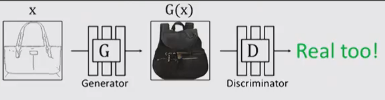

# Visual Synthesis and Manipulation with GANs
[Source video](https://www.youtube.com/watch?v=I_8Dp_fRzv8&index=9&list=PLazcgz-LJ6ZIrJV-qiqw16JyJFuE4TNKF)   
Speaker: Jun-Yan Zhu, UC Berkeley

## Visual Synthesis
* Generating images, ... from descriptive text, labels

### What makes an image look real/fake?

### Deep Generative Models
* GANs, VAE, DRAW (RNN) [Gregor et al. 2015], Pixel RNN + Pixel CNN [Oord et al 2016]

## Challenges of GANs in vision and graphics
* random, hard to control images
* low-resolution, unrealistic photos

## How to manimulate output images with GANs
* [Zhu et al. 2016] *Generative Visual Manipulation on the Natural Image Manifold*
    * Scribble --hard-coded optimization--> Latent space --pretrained GAN--> Image

* Interactive 3D editing with GANs

### Image-to-Image Networks
* [Isola, Zhu, Zhou, Efros, 2017] *Image-to-Image Translation with Conditional Adversarial Networks*   

    * Normal GAN:   
   

    * Conditional GAN: take the source image into consideration for D   

* More examples:

i2i | i2i
:---:|:---:
|
Edge to image|Sketch to image
|
Edges to cats|Maps
|
Labels to Facades|BW to Color
|
Scribbler|Texture GANs
|
Auto-painter|Multi-view Generation
|
Swapping Fashion|Semantic Image Synthesis
|
Super-resolution|Face Destylization
|
GAN in medical field|

## Conclusions
* Visual synthesis is a learning problem.
* We can to do it with trillions of photos.
* Conditional GANs are much easier to train.
* Build general-purpose tools and find cool problems.

# Code 
#pix2pix   
[PyTorch Implementation](https://github.com/junyanz/pytorch-CycleGAN-and-pix2pix)