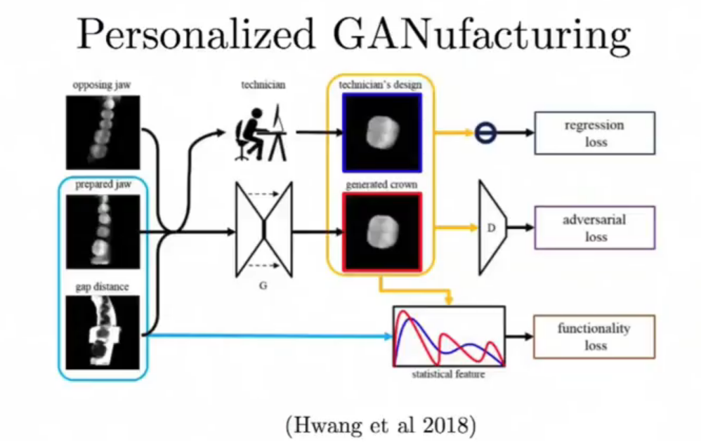
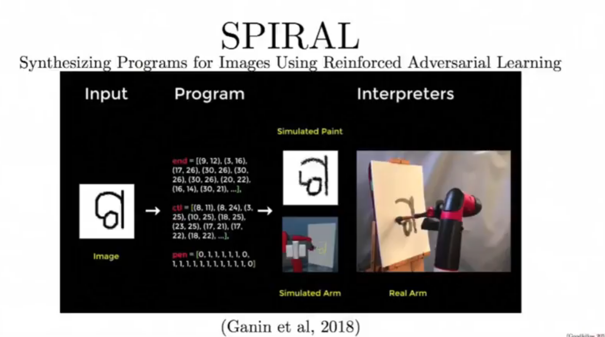
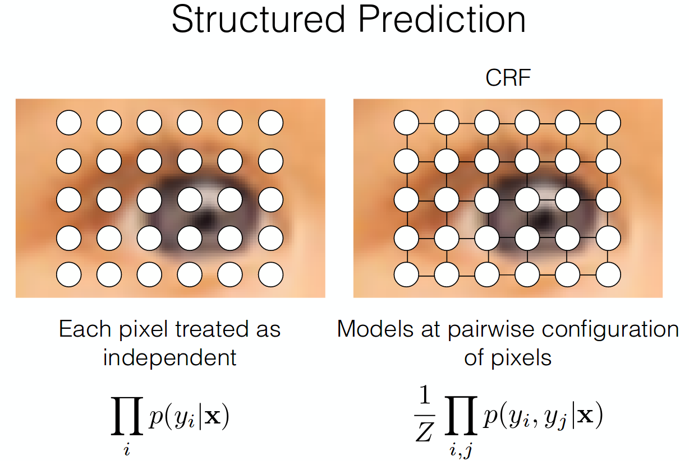
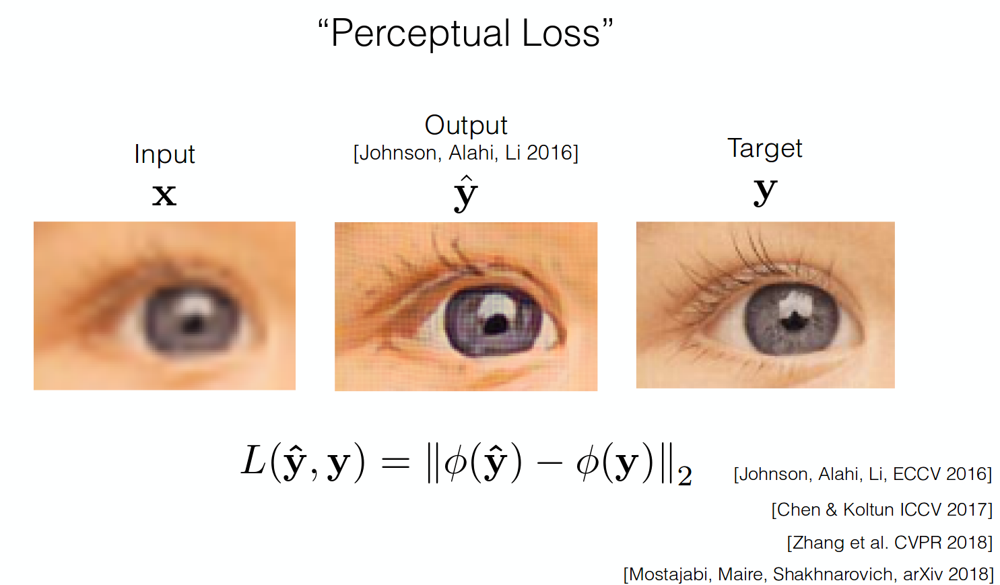

# GANs
## New things
* Brundage et al, 2018: Face Generation
* Zhang et al., 2018: Self-Attention GAN (SAGAN), ImageNet 128x128

## Conditional GANs
* Class-Conditional GANs [Mirza and Osindero, 2014): D(Class labels + Pixel input)
* AC-GAN Specialist Generators: Split Generators into 100 smaller Gs, each responsible for 10 classes
* SN-GAN [Miyato et al, 2017]: Shared Generator (1 G for all classes), recognizable, somewhat high quality

### SAGAN
* Spectral Normalization [Miyato et al, 2017]: normalize eigenvalue spectrum
* Hinge loss
* Two-timescale update rule
* Self-attention [from *Non-local neural networks* - Wang et al 2018]: during generation of images, for each pixel, look around the image and see what the other pixels look like(i.e.: when generate eye, look for the other eye -> symmetric)   
   
    * We can focus attention on unusual part of an image

### Personalized GANufacturing
* Hwang et al. 2018
* Design different items on the fly for each customers

### SPIRAL

# Image-to-image translation
## Challenges
* Output is high-dimensional, structured object
    * -> **Use a deep net D, to analyze output**
* Uncertainty in mapping, many plausible outputs
    * Hallucinations
    * -> **D only cares about "plausibility", doesnt hedge**
    * -> **Can model the distribution of possibilities**

### High-dimensional, structured object: Designing Loss function
* Image colorization: Cross entropy + colorfulness term
* Super-resolution: Deep feature covariance
>>> GANs can deal w/ this
* Cool things:
    * **Structured Prediction**: pairwise config. of pixels instead of independent pixels   
    
    * **Perceptual loss**: match the features instead of match the pixels   
    

### High-dimensional, structured object: Patch Discriminator
* Rather that penalize whether output images are fake, we penalize if each patch (small windows) in output images looks fake
* [Li & Wand 2016]
    * Faster, fewer parameters
    * More supervised observations
    * Applies to arbitraily large images

### Uncertainty in mapping, many plausible outputs: Modeling multiple possible outputs
* Add noise
* BiCycleGAN [Zhu et al., NIPS 2017]: add noise z
* MAD-GAN [Ghosh et al., CVPR 2018]: Two separate generators

## pix2pix: 
*Image-to-image Translation with Conditional Adversarial Networks*
---
# Unpaired Image-to-image translation
## CycleGAN: Cycle-Consistent Adversarial Networks
*Unpaired image-to-image translation using Cycle-Consistent Adversarial Networks*
* When there is no input-output pair like pix2pix (CGAN)
* Usually from 1 image domain (horse) to another domain (zebra)
* Idea: Sentence in EN -> FR -> EN. If EN's D says good -> good
* Applications:
    * Style transfer (paintings)
    * CG2Real, Real2CG
    * Synthetic Data as Supervision [2018]
    * Domain Adaptation
    * Attribute Editing, Object Editing, Font/Character Transfer, Data generation
    * Photo Enhancement [WESPE: Weakly Supervised Photo Enhancer for Digital Cameras]
    * Image Dehazing [Cycle-Dehaze CVPRW 2018]
    * Unsupervised Motion Retargeting [CVPR 2018]
    * Beyond: Medical, voice conversion, Cryptography(CipherGAN), Robotics, NLP(machine translation, text style transfer)
    * 
    * Multi-modality: Augmented CycleGAN
    * Style control: PairedCycleGAN
    * More than 2 domains: StarGAN