# More on GANs
Source: CVPR 2018

# Disentangling Content and Pose w/ an Adversarial loss [Emily Denton, CVPR 2018]
[Slides](http://efrosgans.eecs.berkeley.edu/CVPR18_slides/Disentangling_by_Denton.pdf)   
* Disentangled Representation Net (DrNet)
    * auto-encoder that factorizes image sequences into:
        * temporally constant (content: lighting, background, identity, clothing)
        * temporally varying (pose)

    * Architecture: 2 separate encoders
        * Content encoder: contain predictable from past frame (static/invariant)
        * Pose encoder: dont want to encode anything constant
        * Frame decoder

    * What can it do?
        * Rotating objects: image synthesis by analogy
        * Video prediction: using LSTM + DrNet

## Domain Adaptation: Using Adversarial Loss

* Gradient reversal [Ganin, Lempitsky, 2015]
* Label flip [Tzeng et al., 2017]
* Uniform target [Tzeng et at., 2015]

---
# VAEs and GANs
[Slides](http://efrosgans.eecs.berkeley.edu/CVPR18_slides/VAE_GANS_by_Rosca.pdf)   
* Why this?
    * To prevent **mode collapse**
    <!-- * Improve GAN stability   
    
    * Improve GAN diversity
    * Impro sample quality -->

* Some VAE-GAN hybrids:
    * Adversarial Autoencoder
    * Adversarial Variational Bayes
    * VEEGAN
    * ALI/BiGAN
    * AlphaGAN

* Problems:
    * Hybrids do not deliver on their promise to stablize GAN training or improve VAEs.
    * If we want good samples --> GANs
    * If representation learning is more concerned --> VAEs

---
# Multimodal Unsupervised Image-to-Image Translation
*arXiv:1804.04732*
[Slides](http://efrosgans.eecs.berkeley.edu/CVPR18_slides/MUNIT_by_Liu.pdf)
* Cycle-Consistency (CycleGAN)
## Shared-latent Space for Unsupervised Image-to-Image Translation (UNIT)
* CycleGAN vs UNIT
* UNIT: 640x480 output images
    * Day to night
    * Snowy to Summery
    * Sunny to rainy

## Shared-latent Space for Multimodal Unsupervised Image-to-Image Translation (UNIT)
* UNIT vs. MUNIT
* Why *Multimodal*?
    * improve diversity of translation outputs
    * improve visual quality of translation outputs
* Results:
    * Sketch to images
    * Animal image translation
    * SYNTHIA <> Cityscape
    * ...
* Code: [GitHub](https://github.com/NVlabs/MUNIT)

---
# Adversarial Domain Adaptation
[Slides](http://efrosgans.eecs.berkeley.edu/CVPR18_slides/DA_by_Hoffman.pdf)
## Problems
* Classic problems:
    * Lots of labeled data in source domain
    * Lots of unlabeled/limited labeled data in target domain
* Problems with GAN/CycleGAN in Image2image translation:
    * Correct style + reconstruction, but Wrong semantics   
    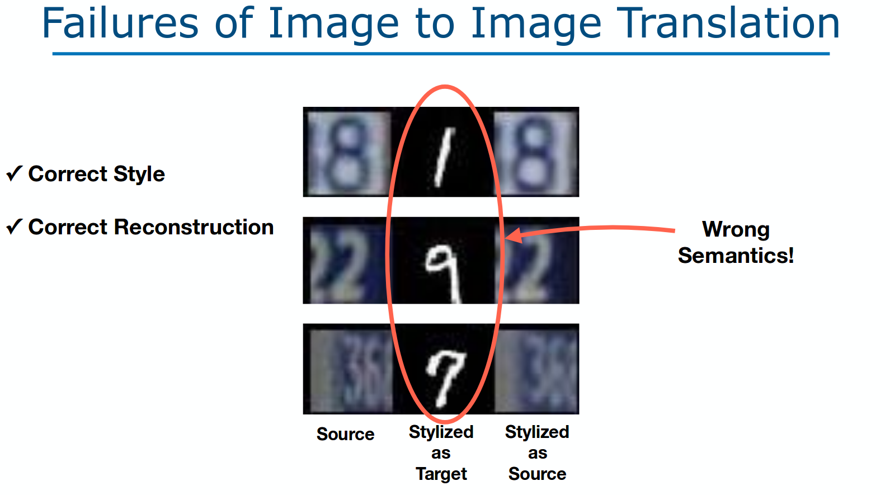

## Main Idea:
* **Minimize discrepancy** between source and target
* It can be computed in **future/representation space** or **image space** or both!
* Learn a representation that cannot distinguish domain (dont let it confuse the model)

## Minimize discrepancy (between 2 dist.)
* **Discrepancy**(n): a lack of compatibility or similarity between two or more facts
* How?:
    * Domain classifier
    * Adversarial Loss   
    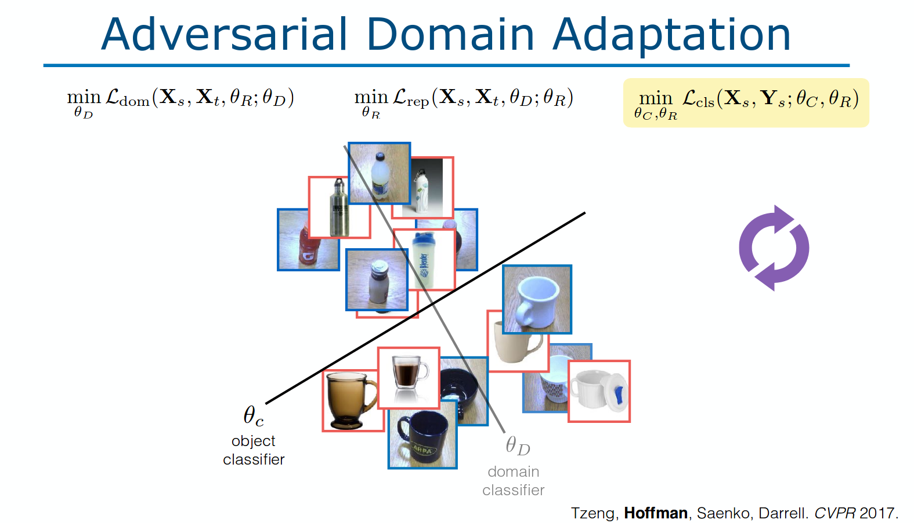

## Optimization Tricks
* 2017: Aligning domains in representation space (picture above)
* [Hoffman et al. ICML 2018]: Align domains in image space   
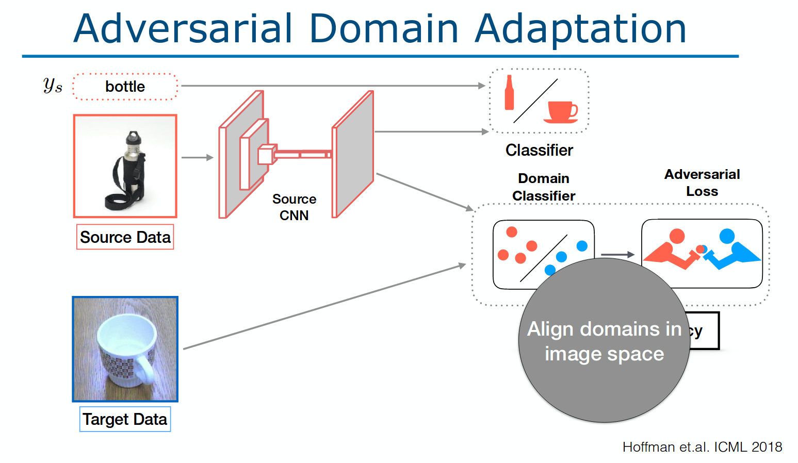
* Related works:
    * Standard GAN   
    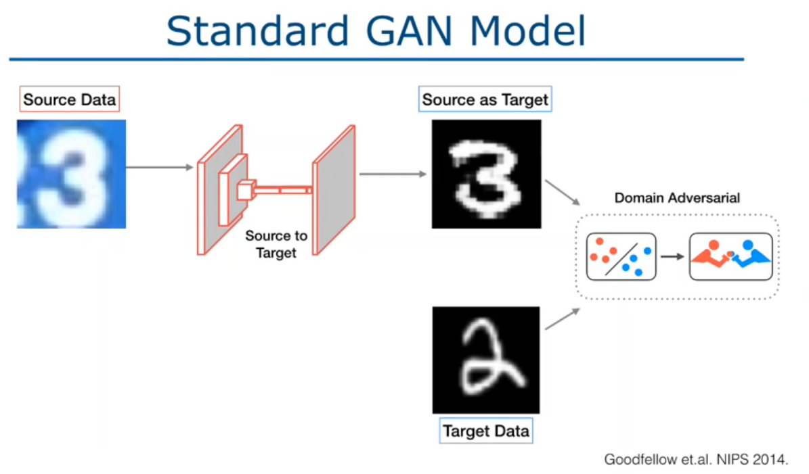
    * CycleGAN for DA   
    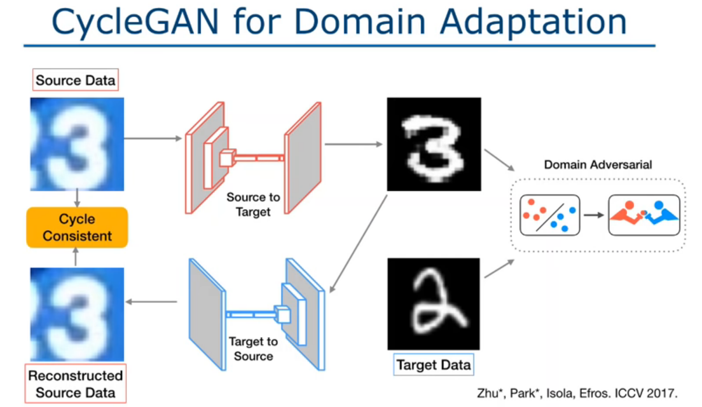
    * Domain Adversarial Adaptation ([Hoffman et al., *CyCADA: Cycle-Consistent Adversarial Domain Adaptation*](https://arxiv.org/pdf/1711.03213.pdf)): add Semantically Consistent term   
    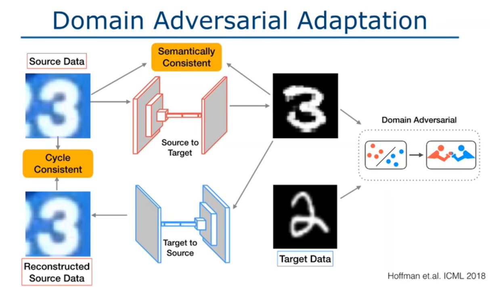

## [CyCADA](https://arxiv.org/pdf/1711.03213.pdf)
* Works in both pixel-level and feature-level
* Doesnot require aligned pairs
* Can work in:
    * Digit classification
    * Semantic Segmentation of road scenes (syn -> real)

---
# Adversaries for Detection and Action
[Slides](http://efrosgans.eecs.berkeley.edu/CVPR18_slides/recognition_by_Wang.pdf)

Keywords: **[Adversarial object detection](https://github.com/xiaolonw/adversarial-frcnn)**, **[Adversarial Grasping]()**, **Adversarial Faster-RCNN**, 

## Adversarial Object Detection
* **Initial idea**: training w/ GAN generated images (more occlusions, deformations than real life datasets)
### Occlusions created by Adver. Net.
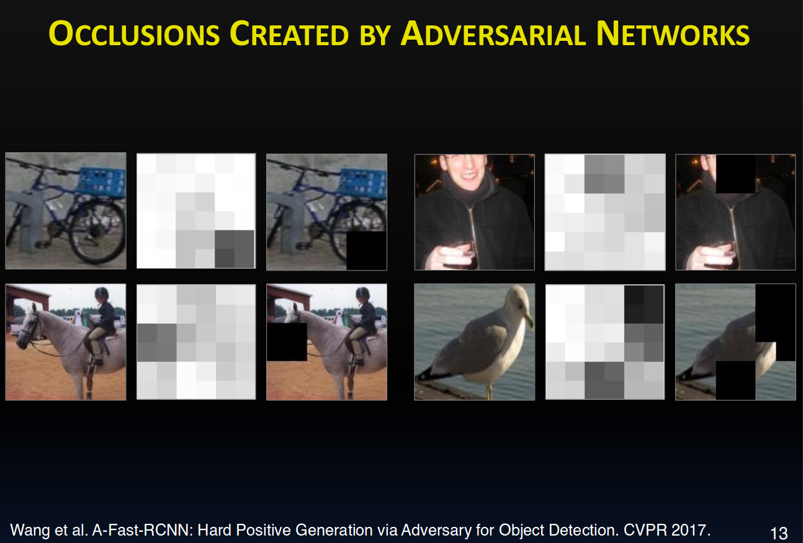
* Adversarial Spatial Dropout Network (ASDN): create a mask (occlusions) on images   
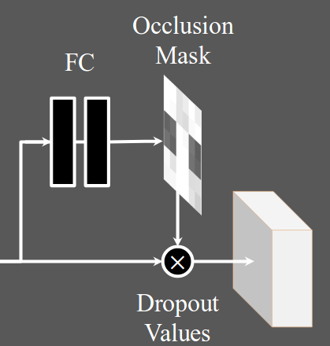
* Adversarial Spatial Transformer Network (ASTN): deform/rotate the **feature** map to generate hard examples.   
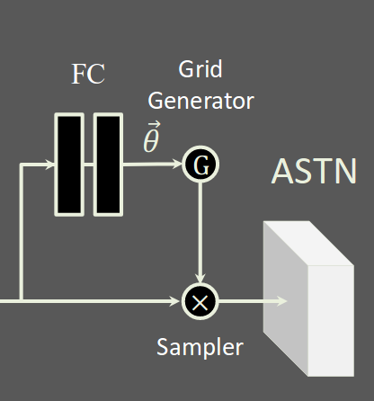
* Training:
    * Stage 1: Fast-RCNN for 10k   
    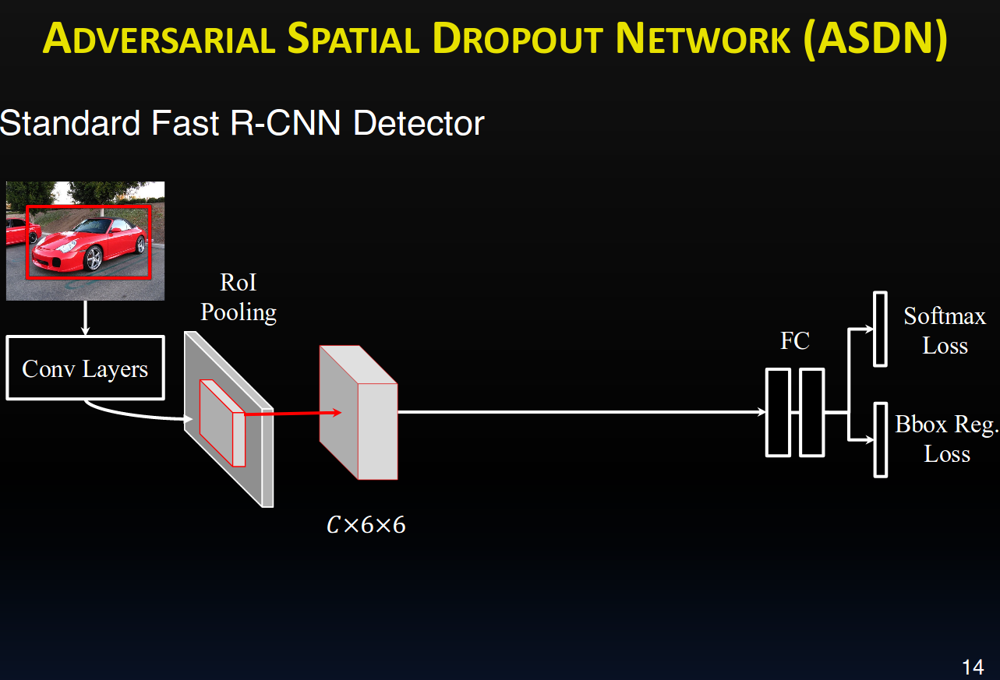
    * Stage 2: Fix Fast-RCNN + train ASDN w/ sliding window search   
    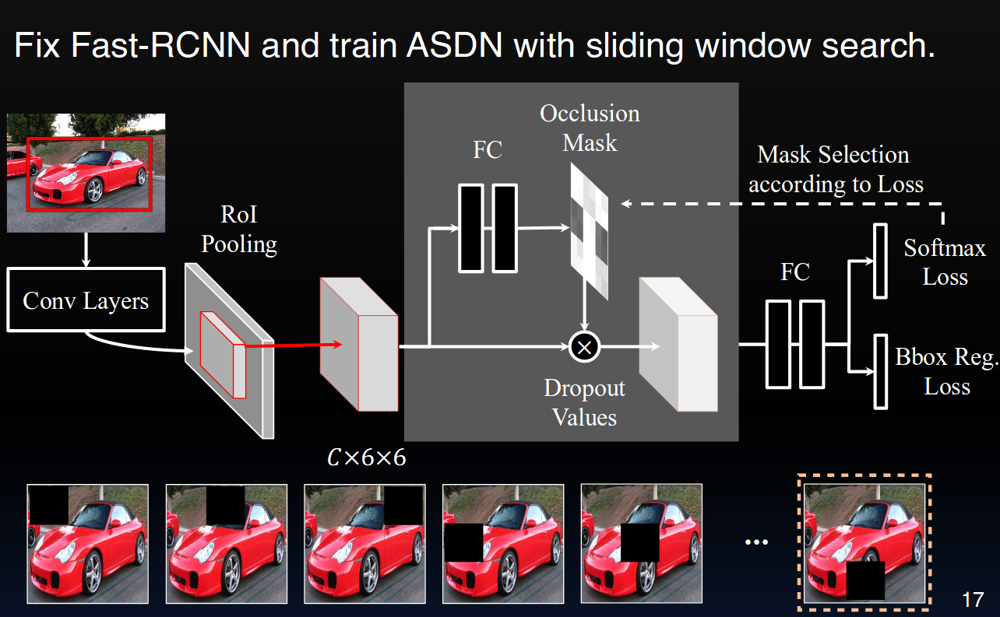
    * Stage 3: Adversarial Joint Learning   
    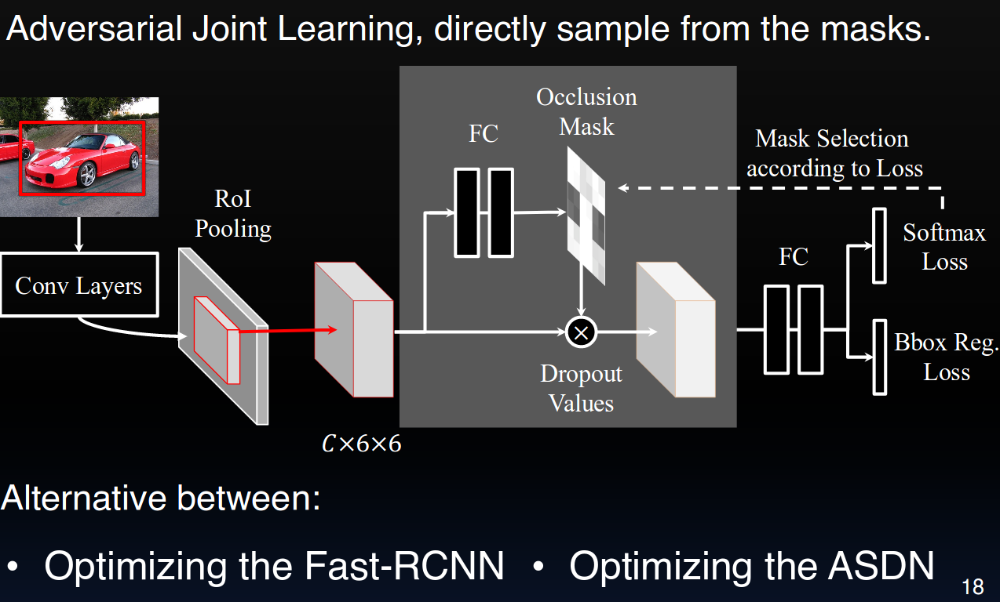

## Adversarial Robot Grasping
* Shaking adversary
* Snatching adversary

--- 
# Generative Adversarial Imitation Learning
[Slides](http://efrosgans.eecs.berkeley.edu/CVPR18_slides/GAIL_by_Ermon.pdf)   
Speaker: Stefano Ermon, Stanford University

Keywords: Reinforcement learning, Imitation learning, GAN, 

## Reinforcement learning
* From **cost function**, find the optimal policy

## Imitation learning (Inverse Reinforcement Learning IRL)
* From **expert behavior**, learn cost function/reward/policy

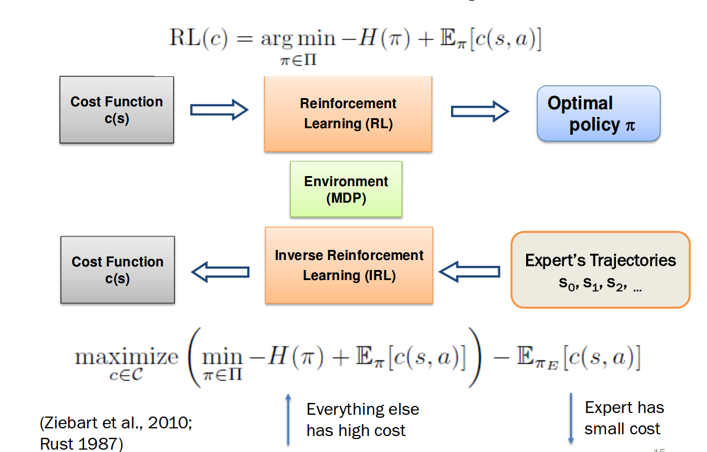

## Combining RL and IRL
(More in slides)

## Apprenticeship Learning
* Issues:
    * Requires carefully crafted features
    * It may be impossible to decode RL∘IRL back to cost function c   

-> Generative Adversarial Imitation learning 
## Generative Adversarial Imitation Learning
* Use a more expressive class of cost functions
* Architecture:   
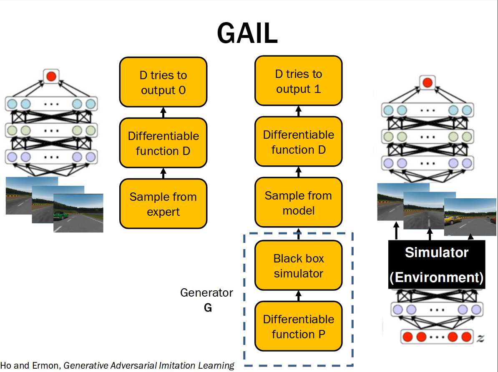
* What's new:
    * Gradient descent over policy parameters (and discriminator)
* Properties
    * Pros:
        * Convergence to local minima
        * Can be model free
    * Cons:
        * High variance
        * Small steps required   
    -> Trust Region Policy Optimization
* More: InfoGAIL, MAGAIL

---
# Video generation and prediction
Slides: Carl Vondrick - [Learning from Unlabeled Video](http://efrosgans.eecs.berkeley.edu/CVPR18_slides/video_by_Vondrick.pdf)

